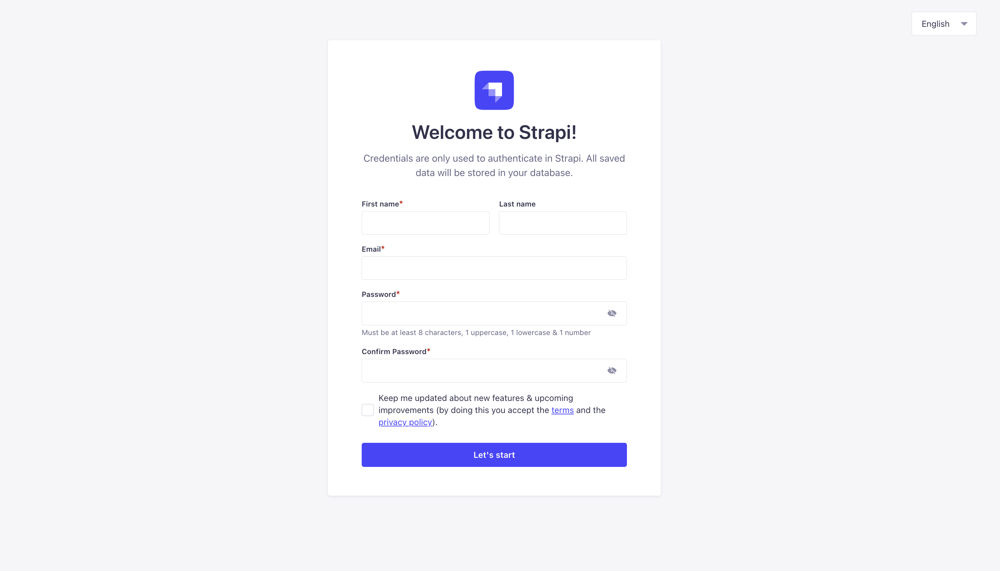
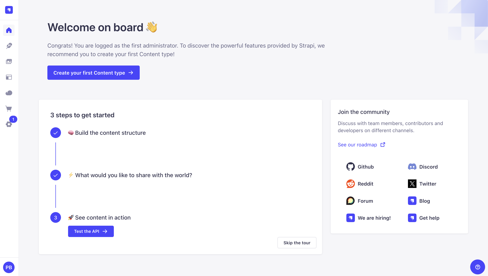
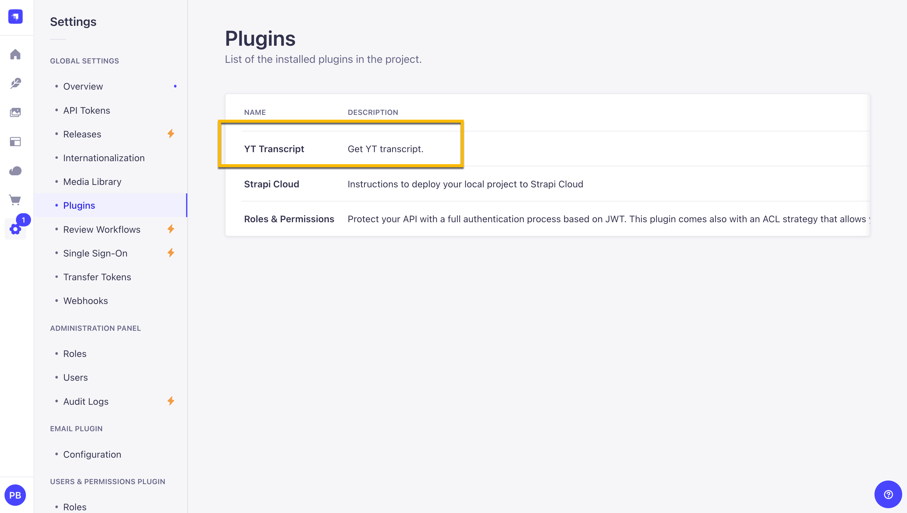
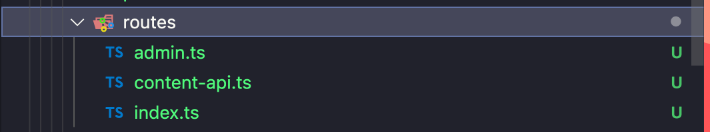
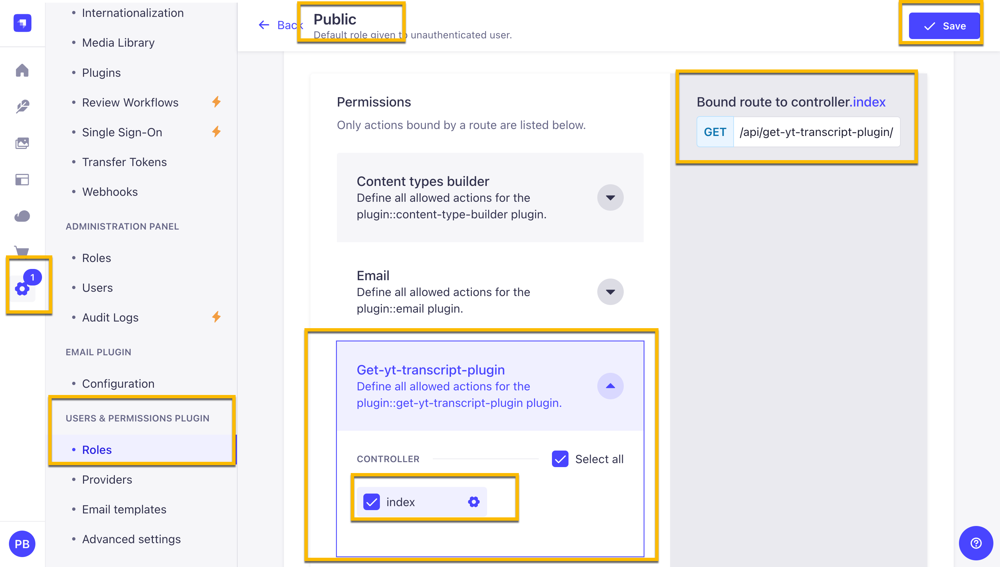
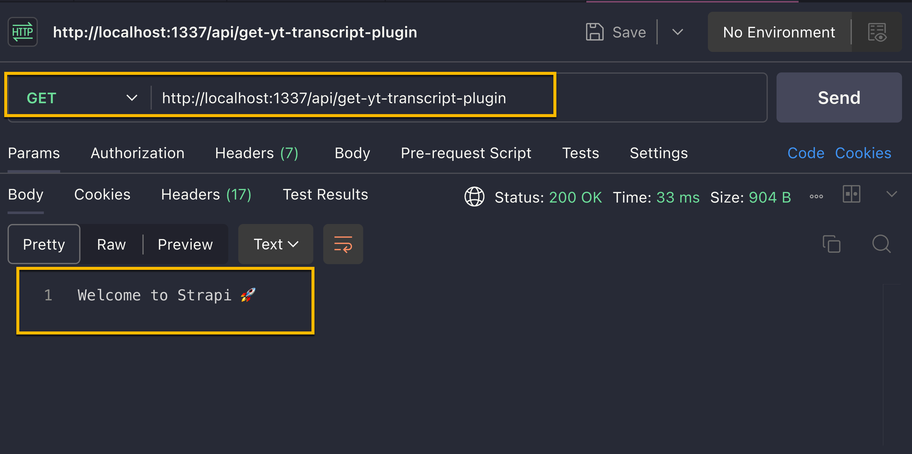
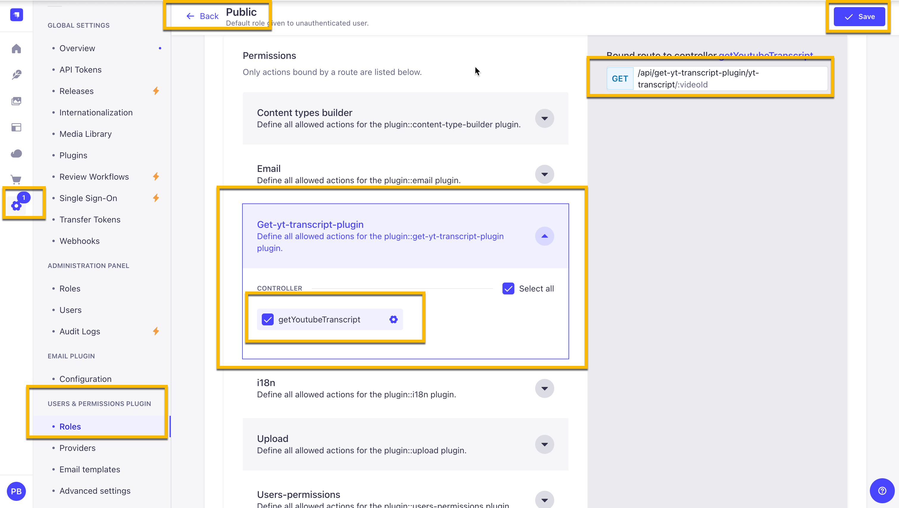
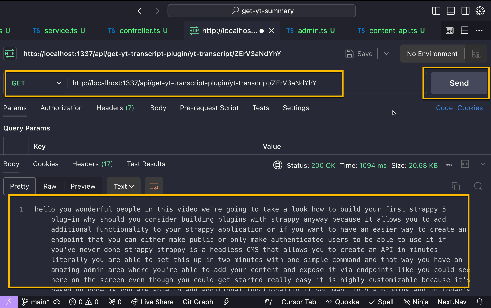

# Building Your First Strapi Plugin: YouTube Transcript Fetcher

This guide will walk you through the process of creating a Strapi plugin that fetches YouTube video transcripts.

TODO: Add a screenshot of the plugin in action.

## Step 1: Set up Strapi

We will start by setting up a new Strapi project. Let's follow the following steps:

1. Create a new Strapi project:

   ```bash
   npx create-strapi-app@latest get-yt-summary
   ```

2. Follow the prompts to set up your project:
   - Use the default SQLite database
   - Don't start with example structure & data
   - Use TypeScript
   - Install dependencies with npm
   - Initialize a git repository

```bash
➜  temp  npx create-strapi-app@latest get-yt-summary
Need to install the following packages:
create-strapi-app@5.0.5
Ok to proceed? (y) y

 Strapi   v5.0.5 🚀 Let's create your new project

We can't find any auth credentials in your Strapi config.

Create a free account on Strapi Cloud and benefit from:

- ✦ Blazing-fast ✦ deployment for your projects
- ✦ Exclusive ✦ access to resources to make your project successful
- An ✦ Awesome ✦ community and full enjoyment of Strapi's ecosystem

Start your 14-day free trial now!


? Please log in or sign up. Skip
? Do you want to use the default database (sqlite) ? Yes
? Start with an example structure & data? No
? Start with Typescript? Yes
? Install dependencies with npm? Yes
? Initialize a git repository? Yes
```

3. Start Strapi:

   ```bash
   cd get-yt-summary
   yarn develop
   ```

4. Create your first admin user through the Strapi admin panel.

You will be greeted with the following screen:



After creating the user, you will be redirected to the admin page:



We are now ready to start building our plugin.

## Step 2: Initialize the Plugin

To help us get started, we will use the Strapi Plugin CLI SDK. You can learn more about it [here](https://github.com/strapi/sdk-plugin).

1. Use the Strapi Plugin CLI SDK to create a new plugin:
   ```bash
   npx @strapi/sdk-plugin@latest init get-yt-transcript-plugin
   ```
2. Follow the prompts to set up your plugin:

```bash
[INFO]  Creating a new package at:  src/plugins/get-yt-transcript-plugin
✔ plugin name … get-yt-transcript-plugin
✔ plugin display name … YT Transcript
✔ plugin description … Get YT transcript.
✔ plugin author name … Paul Brats
✔ plugin author email … paul.bratslavsky@strapi.io
✔ git url …
✔ plugin license … MIT
✔ register with the admin panel? … no
✔ register with the server? … yes
✔ use editorconfig? … yes
✔ use eslint? … yes
✔ use prettier? … yes
✔ use typescript? … yes
```

## Step 3: Configure the Plugin

Now that we have a plugin, we need to configure it to be available in our Strapi application.

1. Reference the plugin in Strapi's configuration. Create or edit `config/plugins.ts`:

   ```typescript
   export default {
     "get-yt-transcript-plugin": {
       enabled: true,
       resolve: "./src/plugins/get-yt-transcript-plugin",
     },
   };
   ```

2. Navigate to the plugin folder and install dependencies:

   ```bash
   cd src/plugins/get-yt-transcript-plugin
   yarn install
   ```

3. Build the plugin:

   ```bash
   yarn build
   ```

4. Start the plugin in watch mode:

   ```bash
   yarn watch
   ```

5. Make sure you are in the root of your Strapi project and restart your Strapi server:
   ```bash
   yarn develop
   ```

We should now see the plugin in the sidebar in the admin panel:



## Step 4: Set Up Plugin Routes

We now need to update our routes, to allow us to have access to the plugin's exposed endpoints in order to be able to use it outside of the admin panel.

Let's make the following change in the `server/src/routes/index.ts` file:

Currently, the file looks like this:

```typescript
export default [
  {
    method: "GET",
    path: "/",
    // name of the controller file & the method.
    handler: "controller.index",
    config: {
      policies: [],
    },
  },
];
```

Currently this defaults to the admin routes, which is meant to be used inside the admin panel.

In Strapi we have two types of routes:

- `content-api`: These are the routes that are meant to be used outside of the admin panel.
- `admin`: These are the routes that are meant to be used inside the admin panel.

Let's update our routes to include both types.

1. Update `src/plugins/get-yt-transcript-plugin/server/src/routes/index.ts`:

   ```typescript
   import contentApi from "./content-api";
   import admin from "./admin";

   export default {
     "content-api": {
       type: "content-api",
       routes: [...contentApi],
     },
     admin: {
       type: "admin",
       routes: [...admin],
     },
   };
   ```

   Now we need to create the routes for both the `content-api` and the `admin`. Let's start with the `content-api` routes.

Create a new file called `content-api.ts` in the `src/plugins/get-yt-transcript-plugin/server/src/routes` folder and add the following:

2. Create `src/plugins/get-yt-transcript-plugin/server/src/routes/content-api.ts`:

   ```typescript
   export default [
     {
       method: "GET",
       path: "/",
       handler: "controller.index",
       config: {
         policies: [],
       },
     },
   ];
   ```

   Now let's create the `admin` routes.

3. Create `src/plugins/get-yt-transcript-plugin/server/src/routes/admin.ts`:

   ```typescript
   export default [
     {
       method: "GET",
       path: "/",
       handler: "controller.index",
       config: {
         policies: [],
       },
     },
   ];
   ```

   You should now have the following file structure:

   

   Nice. Now let's test out our plugin it it's current state to see if it works.

   Make sure your Strapi server is running.

   In Strapi navigate to the `Settings` section and click on the `Users & Permissions` plugin, choose `Roles` and then click on the `Public` role. You should see the `get-yt-transcript-plugin`.

   Select the `get-yt-transcript-plugin` and then click on the `index` endpoint checkbox. Make sure to save.

   Here is a screenshot of what it should look like:

   

   Now you should be able to test the endpoint by visiting:`http://localhost:1337/api/get-yt-transcript-plugin`

   You should see the following response:

   

## Step 5: Create the Service

Now we need to create the service that will be used to fetch the YouTube transcript.

We are going to use the `youtubei.js` library to fetch the transcript. You can learn more about it [here](https://www.npmjs.com/package/youtubei.js).

Don't forget to install the library by running the following command in the root of your plugin folder:

```bash
yarn add youtubei.js
```

Let's start by updating the code in the `services.ts` file found in the `src/plugins/get-yt-transcript-plugin/server/src/services` folder.

1. Create `src/plugins/get-yt-transcript-plugin/server/src/services/service.ts`:

   ```typescript
   import type { Core } from "@strapi/strapi";

   const fetchTranscript = async (
     url: string
   ): Promise<(string | undefined)[] | undefined> => {
     const { Innertube } = await import("youtubei.js");

     const youtube = await Innertube.create({
       lang: "en",
       location: "US",
       retrieve_player: false,
     });

     try {
       const info = await youtube.getInfo(url);
       const transcriptData = await info.getTranscript();
       return transcriptData?.transcript?.content?.body?.initial_segments.map(
         (segment) => segment.snippet.text
       );
     } catch (error) {
       console.error("Error fetching transcript:", error);
       throw error;
     }
   };

   async function getYouTubeTranscript(videoUrl: string) {
     const videoId = new URL(videoUrl).searchParams.get("v");
     const transcript = await fetchTranscript(videoId);
     return transcript?.join(" ");
   }

   const service = ({ strapi }: { strapi: Core.Strapi }) => ({
     async getYoutubeTranscript(videoId: string) {
       const youtubeIdRegex = /^[a-zA-Z0-9_-]{11}$/;
       const isValid = youtubeIdRegex.test(videoId);

       if (!isValid) return { error: "Invalid video ID", data: null };

       try {
         const baseUrl = "https://www.youtube.com";
         const path = "/watch";
         const url = new URL(path, baseUrl);
         url.searchParams.set("v", videoId);

         const transcript = await getYouTubeTranscript(url.href);
         return transcript;
       } catch (error) {
         return { error: "Error fetching transcript: " + error, data: null };
       }
     },
   });

   export default service;
   ```

### Strapi Service Code Summary and Explanation

This above code defines a service that fetches the transcript of a YouTube video using the `youtubei.js` library. Here's a breakdown of what the code does:

**`fetchTranscript` function**:

- This function takes a YouTube video URL as input and returns an array of strings containing the video's transcript, or `undefined` if not available.
- It initializes the YouTube API client using `Innertube.create()` with default settings (language: English, location: US, and without retrieving the video player).
- It retrieves the video information using `youtube.getInfo(url)` and then attempts to fetch the transcript with `info.getTranscript()`.
- The function returns the mapped transcript content by extracting the text from each segment of the transcript.

**`getYouTubeTranscript` function**:

- This function extracts the video ID from a YouTube URL, calls `fetchTranscript` to get the transcript, and joins it into a single string.
- The result is the full transcript of the video.

**`service` function**:

- The `service` function exports a Strapi service that fetches YouTube transcripts.
- It validates the YouTube video ID using a regex pattern (YouTube IDs are exactly 11 characters long and can contain letters, numbers, underscores, and hyphens).
- If the ID is valid, it constructs the full YouTube video URL using the video ID.
- It then calls `getYouTubeTranscript` to retrieve the transcript.
- If successful, the transcript is returned; otherwise, it returns an error message.

## Step 6: Create the Controller

Once you have the service ready, we can focus on creating the controller. As we mentioned before when the request is made to a designated endpoint, Strapi will call the appropriate controller, which will then call the service that we just created.

In the `controller.ts` file found in the `src/plugins/get-yt-transcript-plugin/server/src/controllers` folder, add the following code:

1. Create `src/plugins/get-yt-transcript-plugin/server/src/controllers/controller.ts`:

   ```typescript
   import type { Core } from "@strapi/strapi";

   const controller = ({ strapi }: { strapi: Core.Strapi }) => ({
     async getYoutubeTranscript(ctx) {
       ctx.body = await strapi
         .plugin("get-yt-transcript-plugin")
         .service("service")
         .getYoutubeTranscript(ctx.params.videoId);
     },
   });

   export default controller;
   ```

We updated the following code to reference the service we just created. Now that we have the controller ready, we need to update the routes to point to it before we can test it.

## Step 7: Update the Routes

Remember that we created two types of routes: `content-api` and `admin`. We need to update both of them to point to our new controller.

So make the following changes in both files, `content-api.ts` and `admin.ts`, found in the `src/plugins/get-yt-transcript-plugin/server/src/routes` folder:

```typescript
export default [
  {
    method: 'GET',
    path: '/yt-transcript/:videoId',
    handler: 'controller.getYoutubeTranscript',
    config: {  
      policies: [],  
    },  
  },
];
```

Now that we have the routes updated, we can test the plugin.

But first make sure to rebuild the plugin by running the following command in the root of your plugin folder:

```bash
yarn build
```

And restart your Strapi server by running `yarn develop`.

## Step 8: Test the Plugin

After rebuilding and restarting the Strapi server, let's double check our permissions, since we updated the name of our controller, we need to make sure that the `Public` role has access to it.

Here is a screenshot of what it should look like:



Now let's test in out in **Postman** withing VSCode.

I am going to make a `GET` request to the following endpoint:

```
http://localhost:1337/api/get-yt-transcript-plugin/yt-transcript/ZErV3aNdYhY
```

Just make sure you add a valid YouTube video id.

You should see the following response:



Congratulations! You've now created a Strapi plugin that fetches YouTube video transcripts.

## Conclusion

In this tutorial, we covered the process of creating our first Strapi plugin.

We explored how to set up a new Strapi project, initialize a plugin, configure it, and implement the necessary components such as routes, services, and controllers. 

This example provides a foundation for building more complex plugins with additional functionality.

If you have any questions or feedback, feel free to comment below. Or join us for Strapi's "Open Office Hours" on [Discord](https://discord.com/invite/strapi).

We are there Monday through Friday.

Morning Session:
4 AM CST (9:00 AM GMT)

Afternoon Session:
12:30 PM CST (6:30 PM GMT)

Also, I am in the process of updating [The Epic Next JS with Strapi 5 Blog Series](https://strapi.io/blog/epic-next-js-14-tutorial-learn-next-js-by-building-a-real-life-project-part-1-2) to include this plugin.

As part of the update, we will use this plugin to fetch the transcript for the YouTube video so we can summarize it using AI.

Stay tuned!
